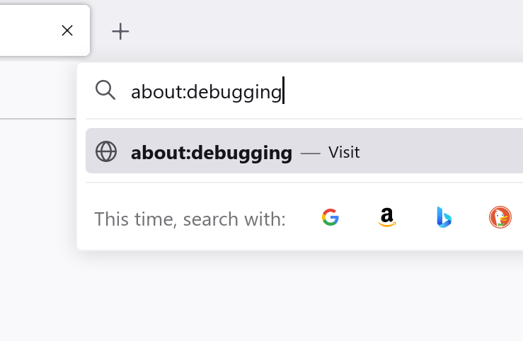
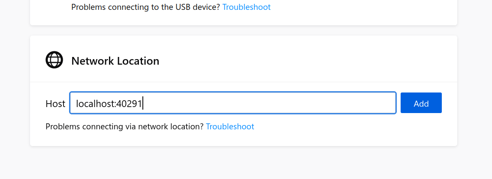
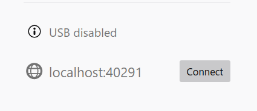
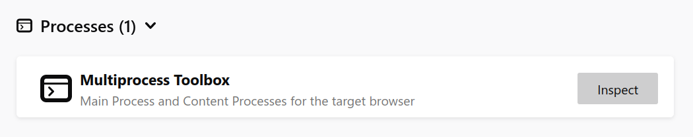
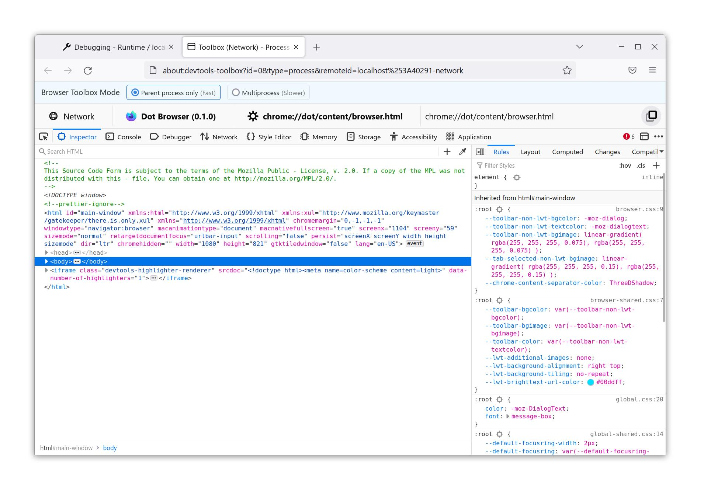

# The Browser DevTools

Dot Browser exposes some APIs when in non-release mode in order to debug and see the internals of the browser.

### Notes

The Browser DevTools **cannot** be used in a release build of Dot. This is due to security risks with exposing these APIs for any program on your computer to access. You will know if Dot Browser has been built in release mode if the `MOZILLA_OFFICIAL=1` option is set in your `mozconfig`.

## How to use

Launch Dot Browser using `./mach run`. Once launched, you should see a message similar to in the logs. Keep note the port number displayed.

```
0:02.70 /home/user/browser/obj-x86_64-pc-linux-gnu/dist/bin/dot
DevTools server started on port 40291.
```

In this instance the port number is `40291`.

Now start by launching Mozilla Firefox (we recommend Nightly or the Developer Edition, but Stable works fine).

Next, navigate to `about:debugging` in the address bar.



Once the page loads, scroll down to the `Network Location` on the `Setup` screen.

In the `Host` box, type in the local address of the DevTools server launched by Dot Browser.

It will be in the format of `localhost:[port from earlier]`, for example: `localhost:40291`.



Click `Add` and you should now see the network location we just added in the sidebar.



Now, click `Connect` next to the network location and if everything is sucessful connecting to the browser process, you should see the following screen:


Then scroll right to the bottom until you see the `Processes` section. Once you see a `Multiprocess Toolbox` entry, click `Inspect` to bring up the Dot Browser Multiprocess Toolbox.



A new tab should then open with the Browser Toolbox page. You have successfully connected to Dot Browser's Browser DevTools. Feel free to hack away and modify, these tools are your friend!


